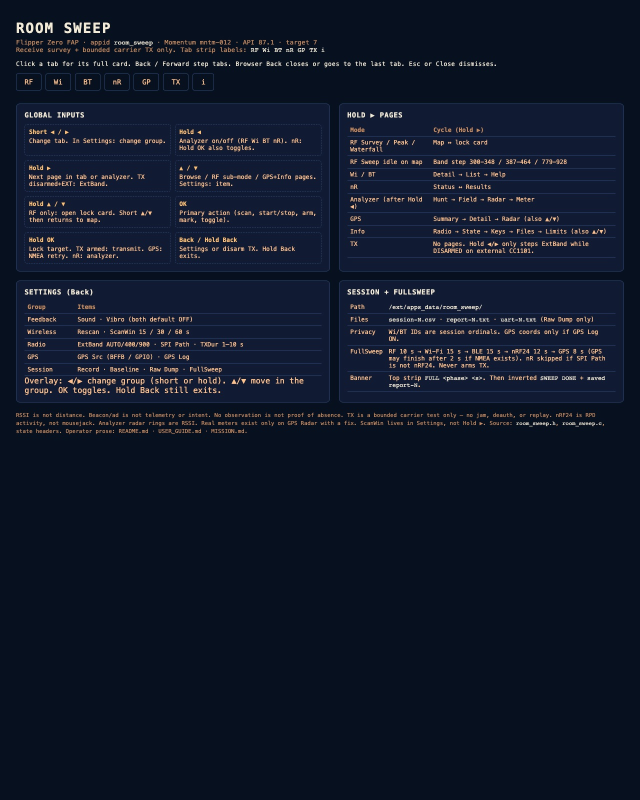

# Room Sweep

Receive-side RF / wireless **room survey** app for Flipper Zero (external FAP,
appid `room_sweep`). Target firmware: **Momentum mntm-012**, API **87.1**,
target **7**.

**Mission constraint:** survey and optional **bounded carrier TX test** only.
No jamming, blocking, deauth, capture/replay, or flood modes.

## Control map

Quick visual of tabs, buttons, Hold-R pages, analyzer, and session files:



Exact-label HTML map (open in a browser for crisp text):

- [`docs/room_sweep_control_map.html`](docs/room_sweep_control_map.html)
- Image asset: [`docs/room_sweep_control_map.jpg`](docs/room_sweep_control_map.jpg)

The map shows structure; the **Controls** tables below are authoritative for
input details (Hold ▲/▼ lock card, GPS Hold-OK retry, tap/hold pulses).

Full operator detail: [`USER_GUIDE.md`](USER_GUIDE.md) · scope: [`MISSION.md`](MISSION.md).

## Hardware

| Path | Role |
|------|------|
| Internal or BFFB external **CC1101** | Sub-GHz survey / optional TX |
| BFFB **ESP32 Marauder** (USART 13/14 @ 115200) | Wi-Fi beacons, BLE sniff, GPS fallback |
| BFFB **nRF24** (SPI; bottom switch) | 2.4 GHz RPD channel activity (RX only) |
| GPIO **LPUART 15/16** | Preferred NMEA GPS when configured |

Bottom SPI switch: **up = CC1101**, **down = nRF24**. Settings **SPI Path**
forces internal CC1101 when nRF24 is selected.

## Tabs (7)

`RF` · `Wi` · `BT` · `nR` · `GP` · `TX` · `i`

| Tab | Purpose |
|-----|---------|
| **RF** | Survey (16 presets) / band Sweep / Peak refine |
| **Wi** | Marauder `sniffbeacon` AP list + analyzer |
| **BT** | Marauder `sniffbt` device list + analyzer |
| **nR** | nRF24 RPD survey (detect only) + analyzer |
| **GP** | GPS fix / sats / mark distance |
| **TX** | Safety-gated arm → long-OK bounded carrier |
| **i** | Status, keys, files, limits |

## Controls (current)

| Input | Meaning |
|-------|---------|
| **Short ◀/▶** | Previous / next tab |
| **Hold ◀** | Analyzer on/off (RF, Wi, BT, nR) |
| **Hold ▶** | **Page inside mode** (see below) |
| **▲/▼** | Browse selection or RF sub-mode / GPS-Info pages |
| **Hold ▲/▼** | **RF lock card** open/close (RF tab) |
| **OK** | Primary action (scan, start sweep, arm TX, GPS mark, …) |
| **Hold OK** | Lock target (or confirm TX when armed). On **GPS**: NMEA retry |
| **Back** | Settings (or disarm TX) |
| **Hold Back** | Exit app |

With **Vibro** ON, a tap gives one soft pulse and a hold gives a double pulse
on release. Sound/Vibro state lives in **Settings → Feedback**.

### Hold ▶ pages by mode

| Mode | Pages |
|------|--------|
| **RF** | Survey/Peak: map ↔ lock card. Sweep (idle map): band step |
| **Wi / BT** | Detail → List → Help → … |
| **nR** | Status ↔ Results |
| **Analyzer** (after Hold L) | Hunt (fat meter) ↔ Field (peer/spectrum bars) |
| **GPS** | Summary ↔ Detail (also ▲/▼) |
| **Info** | Radio → State → Keys → Files → Limits (also ▲/▼) |
| **TX** | No extra pages (safety-critical) |

Scan window **15/30/60s** is **Settings → ScanWin** (not Hold R).
While a **FullSweep** runs, the top strip shows `FULL <phase> <s>` progress
instead of the tab labels; every tab keeps its footer hints visible.

### Analyzer metering (Wi/BT)

- Fat bar follows **selected or locked row** live RSSI from the table.
- Fresh beacons update the bar; after ~2s silence → **STALE fade**; by ~6s → **LOST 0%**.
- While analyzer is open, Marauder scan is kept alive so samples continue.

## Settings (groups)

Feedback · Wireless · Radio · GPS · Session  

Notable items: Sound, Vibro, Rescan, ScanWin, Record, ExtBand, **SPI Path**,
GPS Src, GPS Log, Baseline, Raw Dump, TXDur, **FullSweep**.

**FullSweep** runs RF → Wi-Fi → BLE → nRF24 → GPS with hard timeouts, writes
session + report, shows **SWEEP DONE**.

## Session files

`/ext/apps_data/room_sweep/`

```text
session-N.csv   # event log (privacy ordinals)
report-N.txt    # plain-English Room Report
uart-N.txt      # only if Raw Dump (may hold raw IDs/coords)
```

GPS coordinates omitted unless **GPS Log** is ON.

## Build / test / deploy

```sh
./init.sh          # host tests (-Werror) + ufbt
ufbt               # dist/room_sweep.fap
ufbt launch        # upload + run (app must not already be running)
python3 _verify_api.py
```

## Limits (honest)

- RSSI is **not** distance, identity, ownership, or intent.
- Wi-Fi beacon ≠ Internet telemetry.
- No observation ≠ proof of absence.
- TX is a **bounded carrier** test, not replay or blocking.
- nRF24 path is **RPD / activity**, not mousejack or jam.

## Docs index

| Doc | Use |
|-----|-----|
| [`USER_GUIDE.md`](USER_GUIDE.md) | Operator controls, tabs, analyzer, FullSweep |
| [`MISSION.md`](MISSION.md) | Scope / legal / TX safety contract |
| [`docs/BFFB_MOMENTUM.md`](docs/BFFB_MOMENTUM.md) | BFFB + Marauder + Momentum facts |
| [`docs/room_sweep_control_map.html`](docs/room_sweep_control_map.html) | Exact control map (HTML) |
| [`docs/room_sweep_control_map.jpg`](docs/room_sweep_control_map.jpg) | Control map image |
