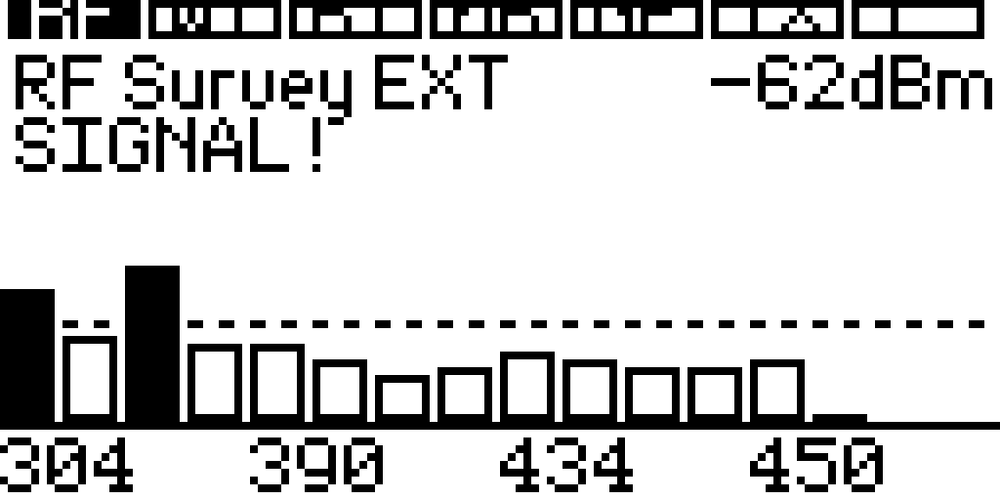

<p align="center">
  
</p>

# Room Sweep

See every signal in the room from your Flipper Zero — Sub-GHz RF, Wi-Fi,
Bluetooth, 2.4 GHz, and GPS — without touching any of it.

Room Sweep is a receive-side room survey app for Flipper Zero (external FAP,
appid `room_sweep`), tuned for **Momentum mntm-012, API 87.1**. Seven tabs —
`RF · Wi · BT · nR · GP · TX · i` — cover the RF spectrum, Wi-Fi beacons, BLE
advertisements, 2.4 GHz activity, GPS walk-to radar, a safety-gated TX carrier
test, and on-device info. It runs on the Flipper's internal CC1101 or a BFFB
board (Marauder / dual CC1101 / nRF24).



**Mission constraint:** survey and optional bounded carrier TX test only.
No jamming, blocking, deauth, capture/replay, or flood modes.

## What it does

- **Survey the room.** 16 RF presets with an alert line and baseline snapshot,
  a mechanical band sweep, peak refine, and a scrolling waterfall with ~10 s of
  history.
- **Wi-Fi & Bluetooth via Marauder.** AP beacons (`sniffbeacon`) and BLE
  advertisements (`sniffbt`): list, detail, lock a target, then hunt it with a
  four-page analyzer — Hunt / Field / Radar / Meter.
- **2.4 GHz energy survey.** nRF24 RPD channel activity, receive only.
- **GPS walk-to radar.** Mark-centered, north-up, real meters with
  auto-scaled rings and your last 8 fixes drawn as an approach trail.
- **Field guide on device.** Every screen prints its own controls; the Info
  tab carries keys, files, and honest limits.
- **Session evidence.** `session-N.csv` plus a plain-English `report-N.txt`;
  Wi-Fi/BLE identities stay session ordinals and GPS coordinates are written
  only if GPS Log is ON.
- **FullSweep.** One press sequences RF → Wi-Fi → BLE → nRF24 → GPS with hard
  timeouts, closes the session, and saves the report.

## Field guide

Every screen explained, one page each, built from real device captures:

**[Download the Field Guide (PDF)](docs/room_sweep_field_guide.pdf)** ·
[Read it as a web page](https://0-cyberdyne-systems-0.github.io/sw33p3r/room_sweep_field_guide.html) ·
[Live control map](https://0-cyberdyne-systems-0.github.io/sw33p3r/)

## Put it on a Flipper

You need Momentum firmware (API 87.1) and
[ufbt](https://github.com/flipper-zero/ufbt).

```sh
git clone https://github.com/0-CYBERDYNE-SYSTEMS-0/sw33p3r.git
cd sw33p3r
./init.sh        # host tests (-Werror) + firmware build — the gate
ufbt             # dist/room_sweep.fap
ufbt launch      # upload + run (app must not already be running)
```

Optional BFFB hardware:

| Path | Role |
|------|------|
| Internal or BFFB external **CC1101** | Sub-GHz survey / bounded TX test |
| BFFB **ESP32 Marauder** (USART 13/14) | Wi-Fi beacons, BLE, GPS fallback |
| BFFB **nRF24** (SPI, bottom switch) | 2.4 GHz activity, RX only |
| GPIO **LPUART 15/16** | Preferred NMEA GPS |

Bottom SPI switch: up = CC1101, down = nRF24. Settings **SPI Path** forces the
internal CC1101 when nRF24 is selected.

## Controls in one breath

◀/▶ changes tabs · Hold ◀ opens the analyzer · Hold ▶ pages inside a mode ·
OK acts · Hold OK locks a target (or transmits when TX is armed) · Back opens
Settings · Hold Back exits. The full table lives in
[`USER_GUIDE.md`](USER_GUIDE.md), and every screen repeats its own controls in
its footer.

## Honest limits

- RSSI is not distance, identity, ownership, or intent.
- A Wi-Fi beacon is not Internet telemetry.
- No observation is not proof of absence.
- TX is a bounded 1–10 s carrier test — never replay or blocking.
- The nRF24 path is activity detection — no jam, no mousejack.

## Docs

| Doc | Use |
|-----|-----|
| [`USER_GUIDE.md`](USER_GUIDE.md) | Full operator manual — controls, tabs, analyzer, FullSweep |
| [`MISSION.md`](MISSION.md) | Scope / legal / TX safety contract |
| [`docs/BFFB_MOMENTUM.md`](docs/BFFB_MOMENTUM.md) | BFFB + Marauder + Momentum hardware facts |
| [Field guide (PDF)](docs/room_sweep_field_guide.pdf) | Screen-by-screen guide, 39 pages |
| [`docs/room_sweep_control_map.html`](docs/room_sweep_control_map.html) | Source of the interactive control map |

## License

[MIT](LICENSE) — the control map, field guide, and screenshots are part of the
project and carry the same license.
