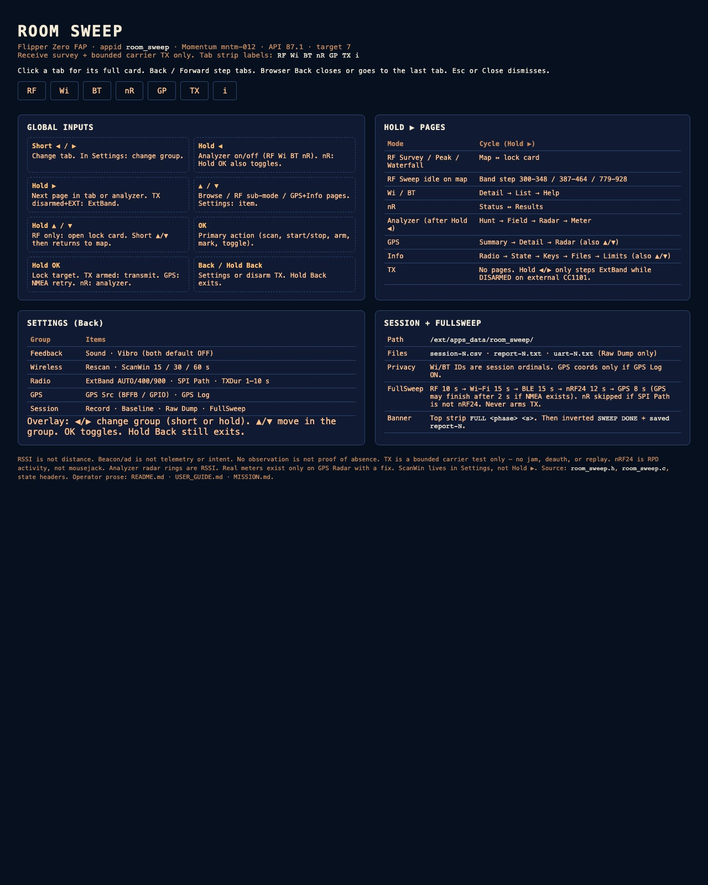
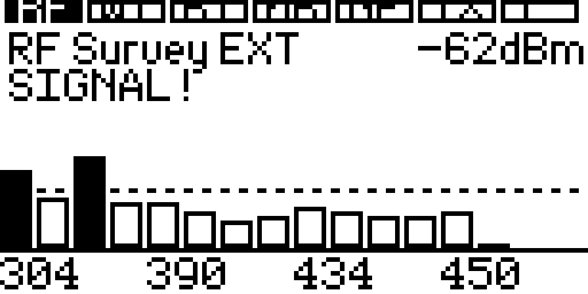

<p align="center">
  
</p>

# Room Sweep

Detect RF activity in the room from your Flipper Zero — Sub-GHz RF, Wi-Fi,
Bluetooth, 2.4 GHz, and GPS — without touching any of it. It tells you
something is transmitting and how loud it is; it cannot tell you what the
transmitter is.

Room Sweep is a receive-side room survey app for Flipper Zero (external FAP,
appid `room_sweep`), tuned for **Momentum mntm-012, API 87.1**. Seven tabs —
`RF · Wi · BT · nR · GP · TX · i` — cover the RF spectrum, Wi-Fi beacons, BLE
advertisements, 2.4 GHz activity, GPS walk-to radar, a safety-gated TX carrier
test, and on-device info. It runs on the Flipper's internal CC1101 or a BFFB
board (Marauder / dual CC1101 / nRF24).



**Mission constraint:** survey and optional bounded carrier TX test only.
No jamming, blocking, deauth, capture/replay, or flood modes.

## What it does

Room Sweep detects the **presence** of RF activity and reads self-reported
names (what devices advertise about themselves) via the ESP32. It never
confirms what a transmitter *is* — no owner, no intent, no verified device
type. What it adds on top of raw detection is honest bookkeeping: a curated
OUI vendor label per MAC and `?`-marked guesses from advertised names. On
the RF tab, "signal" means only "energy above -75 dBm."

- **Survey the room.** 20 RF presets with an alert line and baseline snapshot,
  a mechanical band sweep, peak refine, and a scrolling waterfall with ~10 s of
  history.
- **Wi-Fi & Bluetooth via Marauder.** AP beacons (`sniffbeacon`) and BLE
  advertisements (`sniffbt`): list, detail, lock a target, then hunt it with a
  four-page analyzer — Hunt / Field / Energy Map / Meter. Rows carry a curated
  OUI vendor label (`Vendor: Samsung`), "randomized" for self-assigned MACs,
  and `?`-suffixed name-pattern hints (`CAM?`) — leads and guesses, never
  identification.
- **2.4 GHz energy survey.** nRF24 RPD channel energy — hits are activity
  counts, not packets or devices. Receive only.
- **GPS walk-to radar.** Mark-centered, north-up, real meters with
  auto-scaled rings and your last 8 fixes drawn as an approach trail.
- **Field guide on device.** Every screen prints its own controls; the Info
  tab carries keys, files, and honest limits.
- **Session evidence.** `session-N.csv` plus a plain-English `report-N.txt`;
  Wi-Fi/BLE identities stay session ordinals and GPS coordinates are written
  only if GPS Log is ON.
- **FullSweep.** One press sequences RF → Wi-Fi → BLE → Wi-raw (clients) →
  Wi-probe (hidden-SSID recovery) → nRF24 → GPS with hard timeouts, closes
  the session, and saves the report. A pass with no hardware behind it is
  skipped honestly rather than faked.

## What it does NOT do

- It identifies nothing by itself: no device type confirmation, no owner, no
  intent. What it can say is (a) which company registered a MAC's OUI prefix
  (a short curated table, `unlisted` when absent, `randomized` for
  self-assigned addresses), and (b) that an advertised *name* looks like a
  device class — always printed with a `?` because a name is a guess, and a
  name is not the device.
- Signal strength is a real measurement but not a distance meter. Absolute
  meters are impossible without knowing the transmitter's power, and indoor
  reflections bend every reading.
- The strongest row in a Wi/BT list is the loudest broadcaster, not the
  nearest device. Comparing two devices' RSSI says nothing about distance.
- Coverage is partial: 20 fixed RF presets, three CC1101 bands
  (300–348 / 387–464 / 779–928 MHz) with real gaps, and 5 GHz Wi-Fi
  completely invisible.

## What it can now find

Read the middle column as a lead, never as a verdict: every row is either a
measurement in front of you (energy, an address, a name a device broadcast)
or a heuristic that prints its own `?`.

| The room contains | What Room Sweep can show | What it still cannot say |
|---|---|---|
| A sub-GHz transmitter on the air | A hot preset in Survey, a peak in Sweep/Refine, a burst pattern in Watch (`BURSTS/LAST/DUTY`) | What it is, or whether it is a bug rather than a doorbell |
| Wi-Fi access points | SSID, BSSID, channel, RSSI range and observation count, OUI vendor, `?` name hints | Whether the network is hostile, or whose it is |
| Two or more APs sharing one exact SSID | A `!` mark, `SAME NAME ON n BSSIDS`, `rogue=` in the CSV — a cloned-SSID *lead* (mesh and roaming share names legitimately) | Which one, if any, is the rogue |
| A hidden network with a client nearby | `[hidden]` rows repaired to a real name from the client's own probe request | Anything about the client, or the network beyond its name |
| Client radios and phones that are transmitting | The Wi-raw transmitter radar: one row per `sniffraw` frame with address, channel, RSSI range — clients included | Device type or owner; a `?` hint is a guess from an advertised name |
| A known device from an earlier session | A `WATCH` badge and `watch=1`, if you flagged that address with the opt-in watchlist | That it is the *same physical* device — addresses can be spoofed and randomize |
| An AirTag/Tile-class advert, a camera-named AP, a printer | Curated-OUI vendor plus a `?` hint (`TRK?` `CAM?` `PRT?`) | Confirmation: the name is a self-report and the OUI is a registrant, not a model |
| Something advertising like offensive Wi-Fi tooling | `TOOL` rows and `SNIFFESP`/`PWN` window evidence — a class match on the advertisement | Intent. A Pwnagotchi is also a toy; an ESP32 is also a dev board |
| Cellular activity at the band edge | Energy on the `850`/`880` presets | Anything cellular: the CC1101 cannot decode it, so this is energy in a band, not a phone |

Two examples of the first rows, spelled out: a sub-GHz audio bug
transmitting continuously shows as a persistent hot channel in Survey or
Sweep; a 2.4 GHz Wi-Fi camera that is on the air appears in the AP list with
its OUI vendor and a `CAM?` hint if its advertised name says camera.

Will miss, and cannot be made to catch on this hardware:

- **Silent recorders** — a device that records without transmitting is
  invisible to every receiver ever built.
- **Burst or interval transmitters**, between their transmissions.
- **5 GHz Wi-Fi** entirely, and **LTE/5G mid-band** (the CC1101 tops out at
  928 MHz; the `850`/`880` presets are energy at the cellular band edge, not
  cellular reception).
- **Bluetooth Classic audio** — the BLE scan reads advertisements, not
  Classic pairing or audio.
- **The CC1101's real gaps** (348–387 MHz, 464–779 MHz) and **wired
  devices**.

No hit is not proof of absence.

## Field guide

Every screen explained, one page each, built from sanitized UI captures and
synthetic data fixtures:

**[Download the Field Guide (PDF)](docs/room_sweep_field_guide.pdf)** ·
[Read it as a web page](https://0-cyberdyne-systems-0.github.io/sw33p3r/room_sweep_field_guide.html) ·
[Live control map](https://0-cyberdyne-systems-0.github.io/sw33p3r/)

## Put it on a Flipper

You need Momentum firmware (API 87.1) and
[ufbt](https://github.com/flipper-zero/ufbt).

```sh
git clone https://github.com/0-CYBERDYNE-SYSTEMS-0/sw33p3r.git
cd sw33p3r
./init.sh        # host tests (-Werror) + firmware build — the gate
ufbt             # dist/room_sweep.fap
ufbt launch      # upload + run (app must not already be running)
```

Optional BFFB hardware:

| Path | Role |
|------|------|
| Internal or BFFB external **CC1101** | Sub-GHz survey / bounded TX test |
| BFFB **ESP32 Marauder** (USART 13/14) | Wi-Fi beacons, BLE, GPS fallback |
| BFFB **nRF24** (SPI, bottom switch) | 2.4 GHz activity, RX only |
| GPIO **LPUART 15/16** | Preferred NMEA GPS |

Bottom SPI switch: up = CC1101, down = nRF24. Settings **SPI Path** forces the
internal CC1101 when nRF24 is selected.

## Controls in one breath

◀/▶ changes tabs · Hold ◀ opens the analyzer · Hold ▶ pages inside a mode ·
OK acts · Hold OK locks a target (or transmits when TX is armed) · Back opens
Settings · Hold Back exits. The full table lives in
[`USER_GUIDE.md`](USER_GUIDE.md), and every screen repeats its own controls in
its footer.

## Honest limits

- RSSI trend on one locked target is a real proximity tool — follow
  STRONGER/WEAKER while walking.
- The RSSI absolute value is not distance: unknown transmitter power plus
  indoor multipath make meters impossible.
- A Wi-Fi beacon is not Internet telemetry.
- No observation is not proof of absence.
- TX is a bounded 1–10 s carrier test — never replay or blocking.
- The nRF24 path is activity detection — no jam, no mousejack.

## Not here (yet)

Candidates for future work, **not current features**: Sub-GHz protocol-family
identification (Princeton/CAME-style OOK decoding — Momentum exports the
decoder library to FAPs) and a GPS-gradient bearing estimate while walking.
The earlier "IEEE OUI vendor display" idea shipped as Phase 1 of the
capability expansion: a **curated, IEEE-registry-verified vendor table**
(~60 confident prefixes), not an exhaustive database — unlisted MACs print
`unlisted`, and every name-pattern hint keeps its `?`. Even these never name
a device model or its owner.

## Legal & responsible use

Room Sweep is passive detect/analyze tooling for surveying your own property
and your own hardware — it watches signals, it does not touch them. It
deliberately ships no jamming, deauth, replay, or blocking modes, and its only
transmitter is a short, safety-gated carrier test. You are responsible for
complying with local RF transmission and privacy laws wherever you run it.
The full scope and TX safety contract live in [`MISSION.md`](MISSION.md).

## Docs

| Doc | Use |
|-----|-----|
| [`USER_GUIDE.md`](USER_GUIDE.md) | Full operator manual — controls, tabs, analyzer, FullSweep |
| [`MISSION.md`](MISSION.md) | Scope / legal / TX safety contract |
| [`docs/BFFB_MOMENTUM.md`](docs/BFFB_MOMENTUM.md) | BFFB + Marauder + Momentum hardware facts |
| [Field guide (PDF)](docs/room_sweep_field_guide.pdf) | Screen-by-screen guide, 39 pages |
| [`docs/room_sweep_control_map.html`](docs/room_sweep_control_map.html) | Source of the interactive control map |

## License

[MIT](LICENSE) — the control map, field guide, and screenshots are part of the
project and carry the same license.
